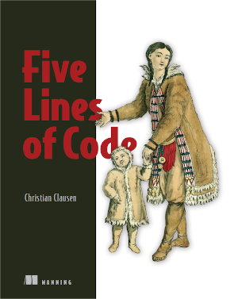

# 📖 파이브 라인스 오브 코드

- 책을 읽고, 이해한 개념 정리 및 예제 코드로 실습 진행

## 노트 정리

| 목차 |                                                                   노션 링크                                                                   |
| ---- | :-------------------------------------------------------------------------------------------------------------------------------------------: |
| 3장  | [🔗](https://yunadev.notion.site/2a53e3973b854cc0855bb81eeeedb8e4?v=03bded1fc01a4d4f9761b187d8f2039a&p=7cbcb3bc53054abd995e994fd0a7e5e5&pm=s) |
