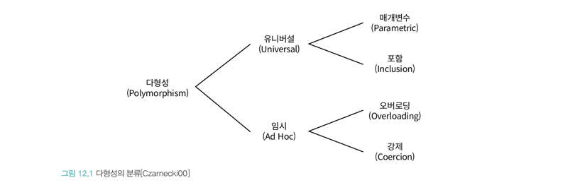
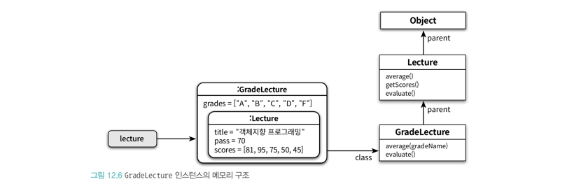
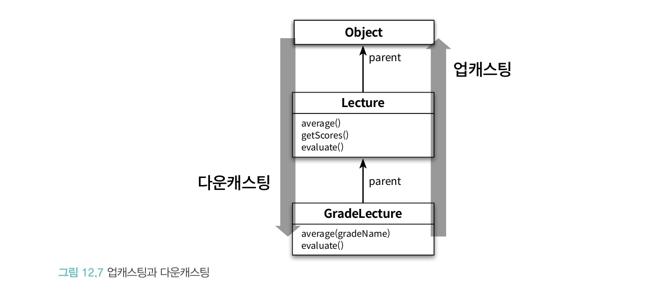
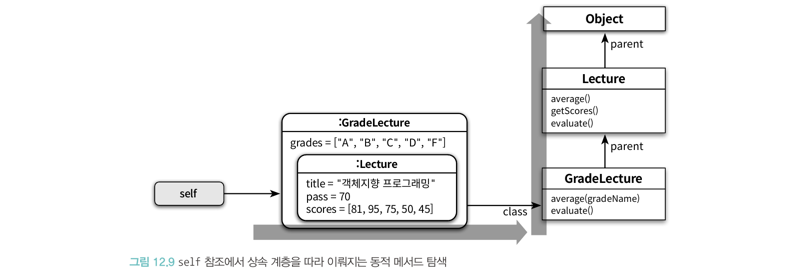

# 다형성

### 알아볼 내용

- 상속의 관점에서 다형성이 구현되는 기술적인 메커니즘

## 다형성이란?

- 그리스어에서 '많은' = 'ploy'와 '형태' = 'morph'의 합성어로 '많은 형태를 가질 수 있는 능력'을 의미한다. 
- 컴퓨터 과학에선 하나의 추상 인터페이스에 대해 서로 다른 구현을 연결할 수 있는 능력으로 정의된다.
- 여러 타입을 대상으로 동작하는 코드를 작성하는 방법이다.



- **오버로딩 다형성**: 하나의 클래스안에 동일한 이름의 메서드가 존경하는 경우
  - 메서드 오버로딩을 사용하면, 유사 작업을 수행하는 메서드들의 이름을 통합할 수 있어 코드의 복잡함을 낮추는데 도움을 준다.

```ts
class Money {
  plus(amount: number): number {...}
  plus(amount: number): string {...}
}
```

- **강제 다형성**: 동일한 연산자를 다양한 타입에 사용할 수 있는 방식을 가리킨다.
  - 피연산자가 모두 정수일 때 이항 연산자인 '+'는 덧셈 연산자로 동작하지만, 하나는 정수이고 또 다른 하나는 문자열일 경우 강제 형변환 되어 연결 연산자로 동작하는 예시가 있다.
  - 오버로딩 다형성과 함께 사용하면, 어떤 메서드가 호출되는지 판단하기 어려워진다.

- **매개변수 다형성**: 제네릭 프로그래밍과 관련이 높다. 클래스나 인터페이스에 임의의 타입인 T를 사용 시점에 구체적인 타입으로 지정하는 방식이다.

- **포함 다형성(서브타입 다형성)**: 메세지는 같더라도 수신 객체의 타입에 따라 수행되는 행동이 달라지는 능력, 일반적인 다형성을 의미한다.
    - 상속을 사용하는 것이 일반적이 구현 방법이다. 이 말은 즉, 부모 클래스의 서브타입이여만 한다.
    - 포함 다형성을 통해 **상속의 목적이 코드 재사용이 아닌 서브타입의 구현이라는 사실**을 눈치채야 한다.


## 상속의 양면성

- 객체지향 프로그래밍을 위해선 항상 데이터와 행동이라는 두 가지 관점을 **함께** 고려해야 한다.
  - 따로 고려하게 된다면, 상속을 그저 재사용 메커니즘으로만 사용하게 될 것이다.
- 상속의 목적은 코드의 재사용이 아닌, 프로그램을 구성하는 개념들을 기반으로 다형성을 가능하게 하는 타입 계층을 구축하기 위한 것이다.
  - 타입 계층에 대한 이해도 없인, 상속은 그저 유지보수 하기 어려운 코드만 만들 뿐이다.

### 데이터 관점에의 상속

- 자식 클래스의 인스턴스 안에 부모 클래스의 인스턴스를 포함하는 개념


### 행동 관점에서의 상속

- 부모 클래스가 정의한 일부 메서드를 자식 클래스의 메서드로 포함 시키는 개념
- 런타임에 자식 클래스에 정의되지 않은 메서드를 부모 클래스 안에서 탐색한다.
- 포인터를 사용해 클래스의 상속 계층을 따라 부모 클래스의 정의로 이동한다. 



### 상속 메커니즘을 이해하기 위한 개념

- 업캐스팅
- 동적 메서드 탐색
- 동적 바인딩
- self 참조
- super 참조

## 업캐스팅과 동적 바인딩

코드 안에서 선언된 참조 타입과 무관하게 메세지를 수신하는 객체의 타입에 따라 실행 메서드가 달라지는 것은 업캐스팅과 동적 바인딩 메커니즘이 작용하기 떄문이다.

- **업캐스팅**: 부모 클래스 타입으로 선언된 변수에 자식 클래스의 인스턴스 할당이 가능하게 하는 것 
  - 컴파일러 관점에서 자식 클래스는 제약 없이 부모 클래스를 대체 가능하다. 그렇기 때문에 부모 클래스의 다양한 자식 클래스들과도 협력하는 것이 가능하다. 
  - 무한한 확장 가능성을 가진다. 즉, 유연한 확장에 용이하다.


- **동적 바인딩**: 메세지 수신 객체 타입에 따라, 실행 시점에 메세지를 처리할 적절한 메서드를 결정하는 것
  - 런타임에 실행될 메서드의 인스턴스를 결정하고 호출한다. 이때, 클래스의 상속 계층의 위치가 결정에 영향을 미친다.
  - 지연 바인딩이라고도 불린다. 

위 두 가지 메커니즘을 통해 코드 변경 없이 메서드를 변경할 수 있다.

> **개방-폐쇄 원칙과 의존성 역전 원칙**
> - 업캐스팅과 동적 바인딩(목적에 이르는 방법)은 코드를 변경하지 않고 기능 추가를 할 수 있게 해주는 개방-폐쇄 원칙(목적)과 일치한다.
> - 개방-폐쇄 원칙의 중심에는 **추상화**가 위치한다.

### self 참조(self reference)

- 동적 바인딩은 **메세지를 수신한 객체**를 가리키는 self 참조로 결정된다.
- 메세지를 수신한 객체의 클래스에서 부터 상속 계층의 역방향으로 메서드 탐색이 진행되고, 종료되면 self는 자동으로 소멸한다.
  - 최상위 클래스에 이르러서도 적절한 메서드를 찾지 못하면 에러 발생하고 메서드 탐색 종료
- 동일한 코드더라도 self 참조가 가리키는 객체 타입에 따라 객체가 실행될 문맥을 동적으로 바꾸는게 가능하다.



#### 동적 바인딩의 두 가지 원리

1. 자동적인 메세지 위임
   - 자식 클래스는 본인이 갖고 있지 않은 메시지를 전송 받으면 상속 계층을 따라 부모 클래스에게 처리를 위임한다. 
2. 동적인 문맥 사용 
   - 메세지를 수신하면, 실행 시점에 self 참조의 탐색 경로를 이용해 실행할 메서드를 결정한다.

> 메서드 오버라이딩과 오버로딩
> 
> **메서드 오버라이딩**
> - 자식 클래스에서 부모 클래스와 **동일한 *시그니처**인 메서드를 갖고 있다면, 자식 클래스에서 메서드 탐색이 종료된다. 
> - 부모 클래스의 메서드를 자식 클래스가 감추는 것 처럼 보이는 것
> 
> **메서드 오버로딩**
> - 자식, 부모 클래스에 이름은 같지만, **동일하지 않은 *시그니처**를 갖고 있어 자식과 부모 클래스에 각각 동일한 이름의 메서드가 공존하고 있는 것
> - C#은 메서드 오버로딩을 금지한다. 
>   - 사용하는 언어의 문법과 메서드 탐색 규칙에 따라 동적 메서드 탐색 규칙이 다르다는 점을 인지하자.
> 
> *시그니처: 메서드 명과 파라미터의 순서, 타입, 개수를 의미

### super 참조(super reference)

- 자식 클래스에서 부모 클래스의 인스턴스 변수나 메서드에 접근하기 위해 사용하는 내부 변수
- super 참조를 통해 메서드를 "호출"하는게 아니라 "전송"하는 것을 명심
- "지금 이 클래스의 부모 클래스에서 부터 메서드를 탐색하세요."라는 의도를 가진다.
- super의 대상은 스칼라를 제외한 대부분의 언어에서 컴파일 시점에 결정된다.