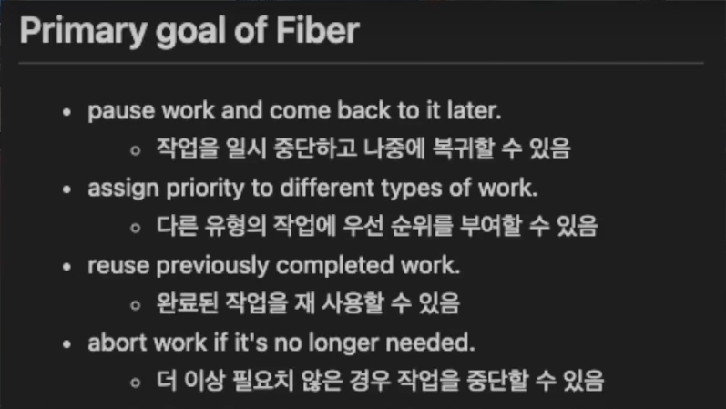

# 리액트 핵심요소 Deep dive

- 리액트를 이루는 핵심적인 개념을 살펴보고, 해당 기능들이 자바스크립트를 토대로 어떻게 동작하는지 톺아보자

## JSX

- 흔히 리액트를 통해 jsx 를 접하는 경우가 많기에, jsx 가 리액트의 전유물이라고 생각하지만 아니다.
- XML 과 유사한 내장형 구문이기 때문에, 브라우저에 의해 실행되거나 표현되지 않는다. 반드시, 트랜스파일러를 거친 이후 자바스크립트 런타임이 이해할 수 있는 자바스크립트 코드로 변환되어야 한다.

### JSX 설계목적

- 자바스크립트로 표현하기 까다로웠던, 다양한 속성을 가진 XML 스타일의 트리 구조를 토큰화하여 EcmaScript 문법에 맞게 변환하는 것에 초점을 두고 있다.

### JSX 정의

- jsx 는 JSXElement, JSXAttributes, JSXChildren, JSXStrings 라는 4가지 컴포넌트르 기반으로 구성되어 있다.
  
#### JSXElement: HTML 요소와 비슷한 역할

요소명은, 반드시 대문자로 시작해야 한다. 그 이유는, 미래에 추가되는 HTML 에 대한 가능성을 열어두고 HTML 태그명과 리액트 컴포넌트를 구분하기 위해서이다.

- `<JSXOpeningElment>`
- `</JSXClosingElement>`
- `<JSXSelfClosingElement />`
- `<>JSXFragment</>`

#### JSXElementName

JSXElement 의 요소 이름으로 사용할 수 있는 것을 의미한다.

- `JSXIdentifier`: 자바스크립트 식별자 규칙과 동일하게, $, _ 외의 특수문자로는 시작할 수 없다.
- `JSXNamespacedName`: `:` 을 통해 서로 다른 식별자를 이어주는 것도 하나의 식별자로 취급된다. 2개 이상의 연결은 불가능하다.
  - `<foo:bar></foo:bar>`
  - `<foo:bar:baz></foo:bar:baz>` // 불가능
- `JSXMemberExpression`: `.` 을 통해 서로 다른 식별자를 이어주는 것도 하나의 식별자로 취급된다. `JSXNamespacedName` 와 달리 2개 이상의 연결이 가능하다.
  - `<foo.bar></foo.bar>`
  - `<foo.bar.baz></foo.bar.baz>` // 가능

#### JSXAttributes

JSXElement 의 속성을 의미하며, 모든 경우가 선택적이다.

- `JSXSpreaAttributes`: 전개 연산자와 동일
- `JSXAttribute`: 속성의 나타내는 key 와 value 의 짝을 이룬다.
    - 값으로 JSXElement 가 들어갈 수 있다. 대부분 `{}` 로 감싸서 정의하지만, `<Element key=<div>JSXElement</div> />` 이렇게도 가능하다. 하지만, prettier 규칙으로 이를 허용하지 않는다.  

#### JSXChildren

JSXElement 의 자식 값, JSX 는 속성을 가진 트리구조를 나타내기 위해 만들어졌으니 부모 자식 관계를 나타낼 수 있다.

- JSXChildren 은 JSXChild 를 0개 이상 가질 수 있다.
  - JSXChild 에는 JSXText, JSXElement, JSXFragment, JSXChildrenExpression(자바스크립트 표현식) 을 포함할 수 있다.
    - `<>{(() => 'Hello')()}</>`

#### JSXStrings

HTML 에서 사용 가능한 문자열은 모두 JSX 에서 사용 가능하다.
자바스크립트와 한 가지 다른 차이점이 바로, `\` 를 이스케이프 문자열로 처리하지 않는 부분이다. 이는 HTML 과 JSX 사이에 복붙을 쉽게하기 위해서이다.

### JSX -> 자바스크립트 변환

- `@babel/plugin-transform-react-jsx` 플러그인은 jsx 구문을 자바스크립트가 이해할 수 있는 형태(`React.createElement()`)로 변환한다.
- jsx 는 결국 `React.createElement` 로 반환된 리액트 엘리먼트로 치환되기 때문에, `children` 요소만 달라지는 경우 아래와 같이 처리하는 것이 중복코드 없이 간결하다.

```jsx
function TextOrHeading({ isHeading, children }) {
  // Nope
  return isHeading ? <h1 className="text">{children}</h1> : <p className="text">{children}</p>;
  
  // Yep
    return React.createElement(isHeading ? 'h1' : 'p', { className: 'text' }, children);
}
```

> :: 🌱
> - [JSX 이해하기](https://ko.legacy.reactjs.org/docs/jsx-in-depth.html)
> - [Writing Markup with JSX](https://react.dev/learn/writing-markup-with-jsx)
> - [JavaScript in JSX with Curly Braces](https://react.dev/learn/javascript-in-jsx-with-curly-braces)

## 가상 DOM 과 리액트 파이버(React Fiber)

### 가상 DOM

가상돔 은, 웹페이지에 표시할 DOM 을 메모리에 저장 후, 실제 변경에 대한 준비가 완료 됐을 때 브라우저의 DOM 에 반영한다. 
이 방식으로, 실제 DOM 을 조작했을 때는 여러번 발생했을 렌더링을 최소화 할 수 있게 된다.

이러한 가상돔을 사용한 렌더링 최적화를 가능하게 한 것이 리액트 파이버다.

### 리액트 파이버

리액트 파이버는 리액트 컴포넌트에 대한 정보(렌더링에 필요한 정보)를 1:1 로 가지고 있는 자바스크립트 객체이다. 
파이버 객체의 정보를 통해, 실제돔과 가상돔 사이 변경된 부분만을 파악하고 파이버를 기준으로 실제돔을 업데이트 한다.
이러한 과정이 재조정(reconciliation) 작업(알고리즘)이라고 이해하면 된다.



리액트는 파이버를 적용하여 기존의 스택 재조정자(reconciliation)의 비효율을 타파하고, 모든 렌더링 작업을 비동기적으로 처리할 수 있게 되었다.

> 파이버가 기존의 스택 재조정자와 근본적으로 다른 점은 동시성이다. DOM 업데이트, 렌더링 로직을 작업 단위로 구분하고 이를 비동기로 실행하여 최대 실행 시간이 16ms가 넘지 않도록 제어한다.
> - [React 파이버 아키텍처 분석](https://d2.naver.com/helloworld/2690975)

#### 파이버의 작업 순서

리액트는 내부에 두 개의 트리를 관리한다. 하나는 현재의 모습을 담은 current 트리, 다른 하나는 변경된 모습을 담은 workInProgress 트리이다.
두 트리의 비교 과정이 끝나면, workInProgress 트리를 current 트리로 바꾸는데 이 기술을 [더블 버퍼링](https://namu.wiki/w/%EB%8D%94%EB%B8%94%20%EB%B2%84%ED%8D%BC%EB%A7%81)이라고 한다.

1. 파이버는 컴포넌트가 최초로 마운트 되는 시점에 생성. 이것이 초기 UI 렌더링을 위한 current 트리
2. 컴포넌트가 업데이트 되면, 파이버는 리액트에게 받은 새로운 데이터로 workInProgress 트리를 빌드하기 시작
3. workInProgress 트리가 완성되면, 다음 렌더링에 이 트리를 사용하여 UI 에 반영
4. 반영이 완료되면, workInProgress 트리를 current 트리로 스왑

최초 렌더링 시에는 모든 파이버를 새롭게 만들어야 하지만, 기존의 객체를 재사용하여 내부 속성값만 초기화하거나 바꾸는 형태로 트리를 업데이트 함

> - 이러한 과정을 파이버 단위로 나누어 처리하기 때문에 과거에는 이 과정을 모두 동기식으로 처리하고 트리를 만드는 작업을 중단할 수 없었지만, 현재는 우선순위에 따라 업데이트 작업을 중단하거나 폐기하는 것이 가능하다.

> :: 🌱
> - [리액트 코어 팀원이 작성한 fiber 아키텍처](https://github.com/acdlite/react-fiber-architecture)


### 파이버와 가상 DOM

파이버는 리액트 내부에서 비동기적으로 작업을 처리하고, 이와 달리 실제 브라우저 구조인 DOM 에 반영하는 것은 동기적으로 이뤄진다.
처리하는 작업이 많아질수록 화면 불완전하게 표시되는 것을 방지하고자, 가상(메모리)에서 이런 작업을 처리 후 최종 결과물만 실제 DOM 에 적용하는 것이다.

리액트 파이버는 브라우저가 아닌 환경에서도 사용될 수 있기 때문에 파이버와 가상 DOM 은 동일한 개념이 아니다. 즉, 브라우저의 DOM 을 효율적으로 관리하기 위한 용도만으로 만들어진 것은 아니다.
이러한 내부 알고리즘을 통해, 대규모 웹 애플리케이션을 효율적으로 유지보수하고 관리할 수 있게 되는 것이다.

### 리액트의 핵심

가상 DOM 과 리액트의 핵심은 화면에 표시되는 UI 를 자바스크립트의 문자열, 배열 등과 마찬가지로 값으로 관리하고 이런 흐름을 효율적으로 관리하기 위한 메커니즘이다.
